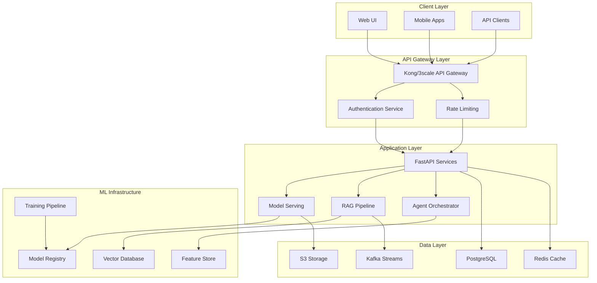
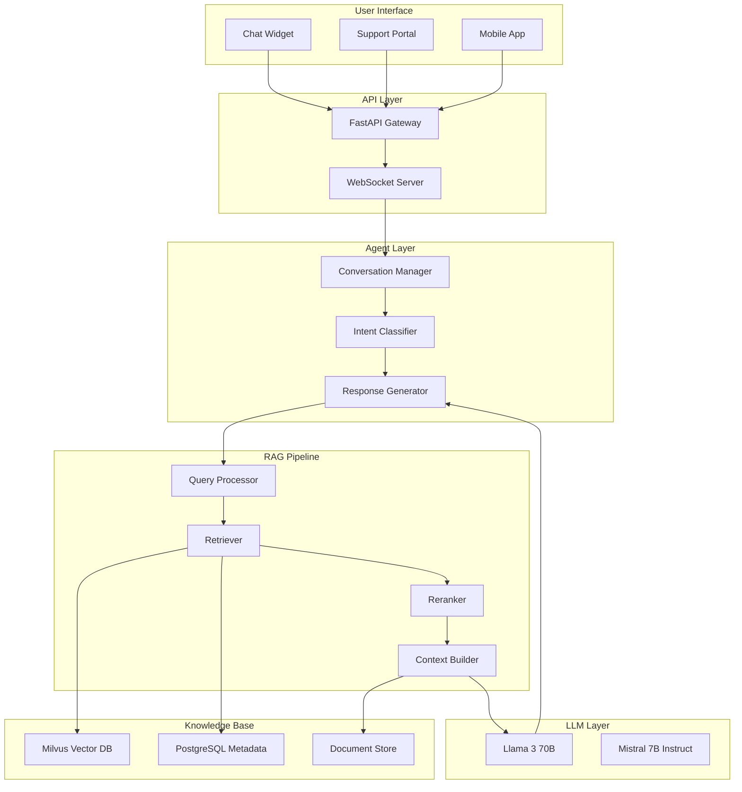
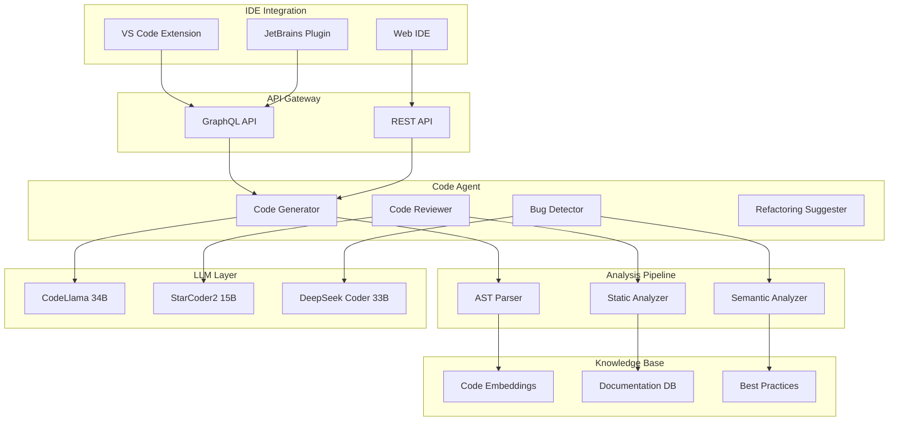
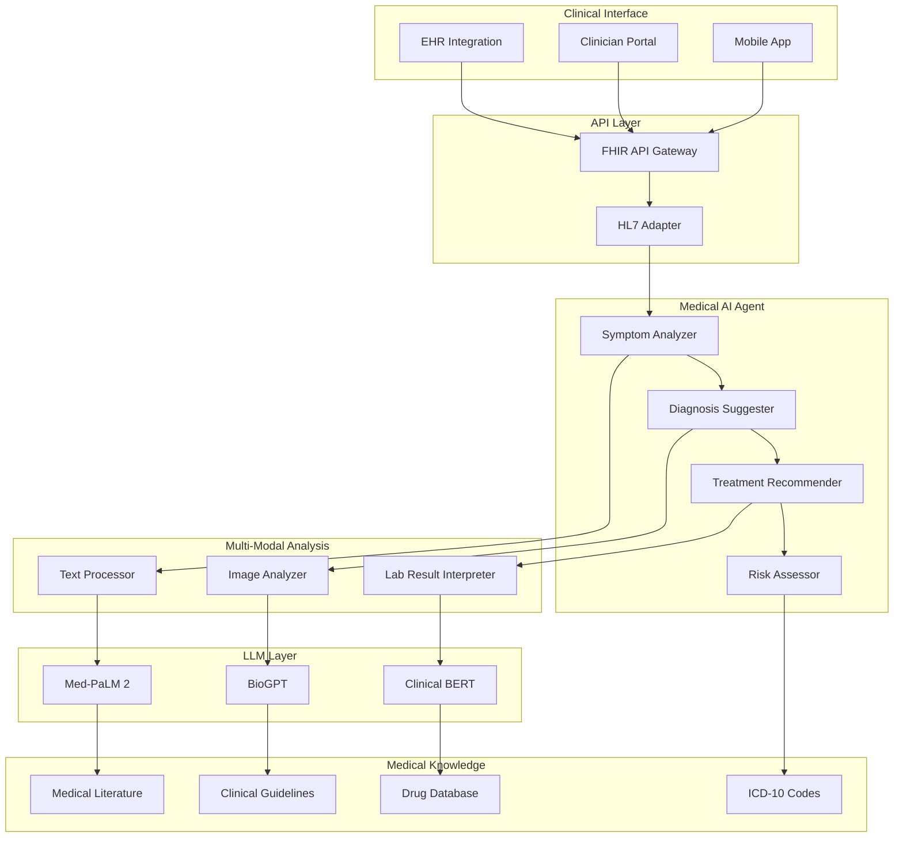
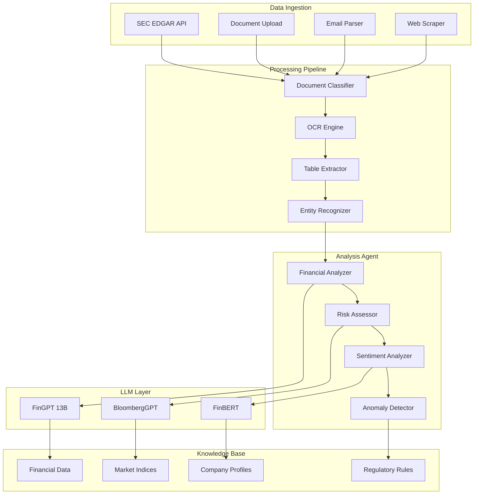
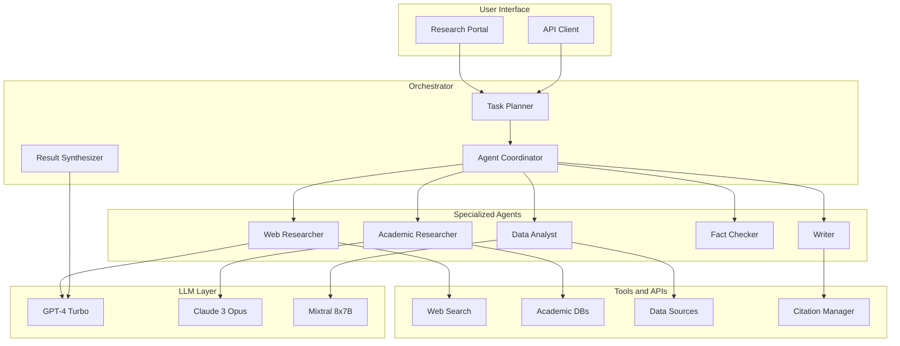
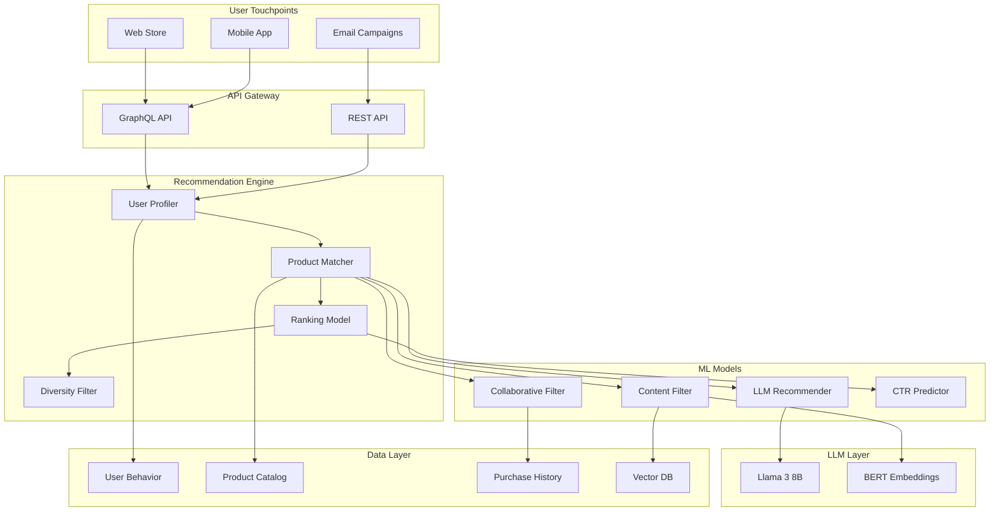
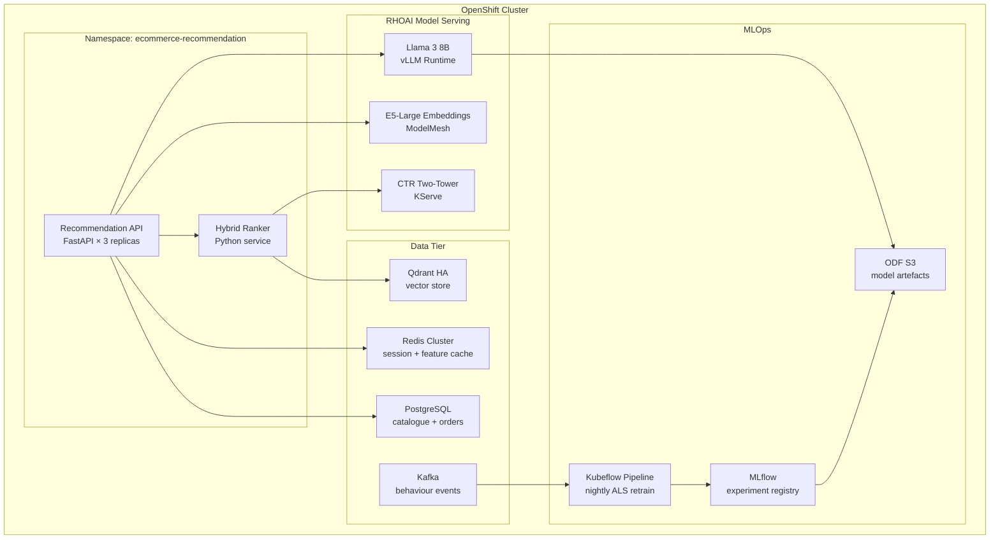

# Comprehensive Architecture Plan: 10 GenAI Projects on Red Hat AI 3.x

**Document Version:** 1.0  
**Target Platform:** Red Hat AI 3.x  
**GPU Infrastructure:** NVIDIA A100 (40GB/80GB)  
**Deployment Scale:** Medium Enterprise  
**Last Updated:** July 2026

---

## Table of Contents

1. [Executive Summary](#executive-summary)
2. [Red Hat AI 3.x Platform Overview](#red-hat-ai-3x-platform-overview)
3. [Common Architecture Framework](#common-architecture-framework)
4. [Project Architectures](#project-architectures)
   - [Project 1: Customer Support AI Agent with RAG](#project-1-customer-support-ai-agent-with-rag)
   - [Project 2: Code Generation and Review Assistant](#project-2-code-generation-and-review-assistant)
   - [Project 3: Medical Diagnosis Support System](#project-3-medical-diagnosis-support-system)
   - [Project 4: Financial Document Analysis](#project-4-financial-document-analysis)
   - [Project 5: Multi-Agent Research Assistant](#project-5-multi-agent-research-assistant)
   - [Project 6: E-commerce Product Recommendation Engine](#project-6-e-commerce-product-recommendation-engine)
   - [Project 7: Legal Document Analysis](#project-7-legal-document-analysis)
   - [Project 8: Educational Content Generator](#project-8-educational-content-generator)
   - [Project 9: Supply Chain Optimization Agent](#project-9-supply-chain-optimization-agent)
   - [Project 10: Creative Content Generation Platform](#project-10-creative-content-generation-platform)
5. [Deployment Architecture](#deployment-architecture)
6. [GPU Optimization Strategies](#gpu-optimization-strategies)
7. [Integration and API Gateway](#integration-and-api-gateway)
8. [Monitoring and Observability](#monitoring-and-observability)

---

## Executive Summary

This document outlines the comprehensive architecture for 10 distinct GenAI projects deployed on Red Hat AI 3.x platform. Each project demonstrates different aspects of modern AI/ML systems including various LLM architectures, RAG implementations, agentic workflows, and training strategies. The architecture is designed for medium-scale enterprise deployments utilizing NVIDIA A100 GPUs with focus on scalability, security, and operational excellence.

### Key Highlights

- **Platform:** Red Hat AI 3.x with OpenShift AI integration
- **GPU Infrastructure:** NVIDIA A100 (40GB/80GB) with multi-GPU support
- **Model Diversity:** GPT-based, BERT-based, T5, specialized domain models
- **RAG Implementations:** Vector databases (Milvus, Weaviate, Qdrant), hybrid search
- **Agentic Frameworks:** LangChain, AutoGen, CrewAI, custom implementations
- **Training Strategies:** Fine-tuning, LoRA, QLoRA, full training, RLHF
- **Deployment:** Containerized microservices with Kubernetes orchestration

---

## Red Hat AI 3.x Platform Overview

### Platform Capabilities

Red Hat AI 3.x (built on OpenShift AI) provides:

1. **Model Serving Infrastructure**
   - KServe for model deployment and serving
   - Seldon Core for advanced ML deployments
   - NVIDIA Triton Inference Server support
   - Model versioning and A/B testing

2. **Development Environment**
   - JupyterHub for collaborative development
   - VS Code integration
   - GPU-accelerated notebooks
   - Integrated MLOps pipelines

3. **Data Management**
   - S3-compatible object storage (OpenShift Data Foundation)
   - Persistent volume claims for model artifacts
   - Data versioning with DVC integration
   - Streaming data pipelines with Kafka

4. **MLOps and Automation**
   - Kubeflow Pipelines for workflow orchestration
   - Tekton for CI/CD pipelines
   - Model registry and versioning
   - Automated retraining pipelines

5. **Security and Governance**
   - Role-based access control (RBAC)
   - Network policies and service mesh (Istio)
   - Secrets management with Vault integration
   - Audit logging and compliance tracking

### Infrastructure Requirements

**Compute Nodes:**
- 4-8 GPU nodes with NVIDIA A100 (40GB or 80GB)
- 16-32 CPU cores per node
- 256-512 GB RAM per node
- NVMe SSD for fast I/O

**Storage:**
- 50-100 TB object storage for datasets and models
- 10-20 TB high-performance block storage for training
- Backup and disaster recovery infrastructure

**Network:**
- 100 Gbps InfiniBand or RoCE for GPU-to-GPU communication
- 10 Gbps Ethernet for general traffic
- Load balancers for API endpoints

---

## Common Architecture Framework

### Shared Components

All projects utilize a common set of infrastructure components:



### Technology Stack

**Core Frameworks:**
- PyTorch 2.x for model training and inference
- TensorFlow 2.x for specific use cases
- Hugging Face Transformers for pre-trained models
- LangChain for RAG and agent orchestration

**Vector Databases:**
- Milvus for high-performance similarity search
- Weaviate for semantic search with GraphQL
- Qdrant for production-grade vector operations

**Model Serving:**
- vLLM for high-throughput LLM inference
- TensorRT-LLM for optimized NVIDIA GPU inference
- Ray Serve for distributed serving

**Monitoring:**
- Prometheus for metrics collection
- Grafana for visualization
- OpenTelemetry for distributed tracing
- ELK stack for log aggregation

---

## Project Architectures

### Project 1: Customer Support AI Agent with RAG

#### Use Case Description

An intelligent customer support system that provides accurate, context-aware responses by retrieving relevant information from company knowledge bases, product documentation, and historical support tickets.

**Business Value:**
- 70% reduction in average response time
- 24/7 availability with consistent quality
- 40% reduction in support costs
- Improved customer satisfaction scores
- Scalable support for growing customer base

#### Architecture Overview



#### Key Components

**1. LLM Selection:**
- **Primary Model:** Llama 3 70B (fine-tuned on support conversations)
- **Fallback Model:** Mistral 7B Instruct (for faster responses)
- **Embedding Model:** BGE-large-en-v1.5 for document embeddings

**2. RAG Implementation:**
- **Vector Database:** Milvus with HNSW indexing
- **Chunk Strategy:** Recursive character splitting (512 tokens, 50 overlap)
- **Retrieval:** Hybrid search (dense + sparse with BM25)
- **Reranking:** Cross-encoder model (ms-marco-MiniLM-L-12-v2)
- **Context Window:** 4096 tokens with dynamic context selection

**3. Agentic Workflow:**
- Single agent with tool-using capabilities
- Tools: Knowledge base search, ticket lookup, escalation trigger
- Memory: Conversation history with Redis backend
- Guardrails: Content filtering and response validation

#### Technologies

**Core Stack:**
- PyTorch 2.1+ for model inference
- Hugging Face Transformers 4.36+
- LangChain 0.1+ for RAG orchestration
- FastAPI 0.104+ for API services

**Infrastructure:**
- Milvus 2.3+ for vector storage
- PostgreSQL 15+ for metadata
- Redis 7+ for caching and session management
- MinIO for document storage

#### Model Training Strategy

**Phase 1: Data Preparation**
- Collect 100K+ historical support conversations
- Clean and anonymize customer data
- Create instruction-tuning dataset format
- Split: 80% train, 10% validation, 10% test

**Phase 2: Fine-tuning Approach**
- Method: QLoRA (4-bit quantization)
- Base Model: Llama 3 70B
- LoRA rank: 64, alpha: 128
- Training: 3 epochs with cosine learning rate schedule
- Batch size: 4 per GPU with gradient accumulation (8 steps)
- Learning rate: 2e-4 with warmup

**Phase 3: Evaluation**
- Automated metrics: BLEU, ROUGE, BERTScore
- Human evaluation: Relevance, accuracy, helpfulness
- A/B testing with 10% traffic split

#### Deployment Architecture on Red Hat AI 3.x

**Resource Allocation:**
- 2x NVIDIA A100 80GB for primary model serving
- 1x NVIDIA A100 40GB for embedding generation
- 4 CPU pods (8 cores, 32GB RAM each) for API services
- 2 CPU pods for vector database

**Deployment Configuration:**
```yaml
Model Serving:
  - Deployment: KServe with vLLM runtime
  - Replicas: 2 (active-active)
  - GPU: 1x A100 80GB per replica
  - Quantization: AWQ 4-bit
  - Max batch size: 128
  - Max concurrent requests: 256

RAG Pipeline:
  - Deployment: Custom FastAPI service
  - Replicas: 4 (auto-scaling 2-8)
  - CPU: 8 cores, 32GB RAM per replica
  - Embedding batch size: 32

Vector Database:
  - Deployment: StatefulSet
  - Replicas: 3 (with replication)
  - Storage: 500GB SSD per replica
  - Memory: 64GB per replica
```

**Scaling Strategy:**
- Horizontal pod autoscaling based on request latency
- GPU utilization target: 70-80%
- Auto-scale API pods: 50-70% CPU utilization
- Vector DB read replicas for query load distribution

#### GPU Optimization

**Inference Optimization:**
- vLLM with PagedAttention for efficient memory management
- Continuous batching for improved throughput
- Tensor parallelism across 2 GPUs for 70B model
- FP16 mixed precision inference
- KV cache optimization

**Memory Management:**
- Model quantization: AWQ 4-bit (reduces memory by 75%)
- Gradient checkpointing during fine-tuning
- Flash Attention 2 for 2-4x speedup
- Dynamic batching with priority queuing

**Performance Targets:**
- Latency: <2 seconds for 95th percentile
- Throughput: 100+ requests/second
- GPU utilization: 70-80%
- Token generation: 50-80 tokens/second

#### Integration Points

**APIs:**
- REST API: `/v1/chat/completions` (OpenAI-compatible)
- WebSocket: `/v1/chat/stream` for real-time responses
- Admin API: `/v1/admin/feedback` for human feedback collection

**External Integrations:**
- CRM systems (Salesforce, HubSpot) via webhooks
- Ticketing systems (Zendesk, Jira) for escalation
- Analytics platforms (Mixpanel, Amplitude) for tracking
- Authentication: OAuth 2.0 / SAML 2.0

**Data Pipelines:**
- Real-time ingestion: Kafka for new documents
- Batch processing: Airflow for periodic updates
- Embedding generation: Scheduled jobs every 6 hours
- Model retraining: Monthly with new conversation data

---

### Project 2: Code Generation and Review Assistant

#### Use Case Description

An AI-powered coding assistant that generates code, reviews pull requests, suggests improvements, and helps developers write better code faster across multiple programming languages.

**Business Value:**
- 30-40% increase in developer productivity
- Reduced code review time by 50%
- Improved code quality and consistency
- Faster onboarding for new developers
- Reduced technical debt accumulation

#### Architecture Overview



#### Key Components

**1. LLM Selection:**
- **Primary Model:** CodeLlama 34B Instruct (fine-tuned on company codebase)
- **Specialized Models:**
  - StarCoder2 15B for code completion
  - DeepSeek Coder 33B for complex reasoning
- **Embedding Model:** CodeBERT for code similarity search

**2. RAG Implementation:**
- **Vector Database:** Weaviate with code-specific schema
- **Indexing Strategy:** Function-level and file-level embeddings
- **Retrieval:** Semantic search with AST-aware filtering
- **Context:** Repository structure, related files, documentation
- **Reranking:** Code similarity scoring with tree-edit distance

**3. Agentic Workflow:**
- Multi-tool agent with specialized capabilities
- Tools: Code search, documentation lookup, test generation, linting
- Planning: Chain-of-thought reasoning for complex tasks
- Validation: Syntax checking, test execution, security scanning

#### Technologies

**Core Stack:**
- PyTorch 2.1+ with CUDA 12.1
- Hugging Face Transformers with custom tokenizers
- Tree-sitter for AST parsing
- FastAPI with async support

**Code Analysis:**
- Pylint, ESLint, RuboCop for linting
- SonarQube for code quality metrics
- Semgrep for security scanning
- pytest, Jest for test execution

**Infrastructure:**
- Weaviate 1.23+ for vector storage
- PostgreSQL for metadata and user data
- Redis for caching and rate limiting
- GitLab/GitHub API integration

#### Model Training Strategy

**Phase 1: Data Collection**
- Scrape 10M+ code snippets from GitHub (permissive licenses)
- Internal codebase: 5M+ lines of code
- Code review comments: 500K+ reviews
- Bug fix commits: 100K+ examples

**Phase 2: Fine-tuning Approach**
- **Method:** LoRA with rank 128
- **Base Model:** CodeLlama 34B
- **Training Tasks:**
  - Code completion (fill-in-the-middle)
  - Code explanation and documentation
  - Bug detection and fixing
  - Code review generation
- **Training:** 5 epochs with learning rate 1e-4
- **Batch size:** 2 per GPU with gradient accumulation (16 steps)

**Phase 3: Specialized Training**
- Instruction tuning on code review dataset
- RLHF with developer feedback
- Continual learning with new code patterns

#### Deployment Architecture on Red Hat AI 3.x

**Resource Allocation:**
- 3x NVIDIA A100 80GB for model serving (tensor parallelism)
- 1x NVIDIA A100 40GB for embedding generation
- 6 CPU pods (16 cores, 64GB RAM) for API and analysis
- 2 CPU pods for vector database

**Deployment Configuration:**
```yaml
Model Serving:
  - Primary: CodeLlama 34B
    - Deployment: vLLM with tensor parallelism
    - GPUs: 2x A100 80GB
    - Quantization: GPTQ 4-bit
    - Max sequence length: 16384
    - Batch size: 64
  
  - Secondary: StarCoder2 15B
    - Deployment: TensorRT-LLM
    - GPU: 1x A100 40GB
    - Quantization: FP16
    - Max sequence length: 8192
    - Batch size: 128

API Services:
  - Replicas: 6 (auto-scaling 4-12)
  - CPU: 16 cores, 64GB RAM per replica
  - Request timeout: 30 seconds
  - Rate limit: 100 requests/minute per user

Code Analysis:
  - Replicas: 4
  - CPU: 8 cores, 32GB RAM per replica
  - Parallel analysis: 8 files simultaneously
```

**Scaling Strategy:**
- Auto-scale based on queue depth and latency
- GPU utilization target: 75-85%
- Separate pools for code generation vs. review
- Priority queuing for interactive requests

#### GPU Optimization

**Inference Optimization:**
- Tensor parallelism for 34B model across 2 GPUs
- Pipeline parallelism for longer sequences
- Speculative decoding for faster generation
- Continuous batching with dynamic padding
- Flash Attention 2 for memory efficiency

**Memory Management:**
- GPTQ 4-bit quantization (4x memory reduction)
- KV cache quantization (INT8)
- Paged attention for variable-length sequences
- Model offloading for less frequent models

**Performance Targets:**
- Code completion: <500ms latency
- Code review: <5 seconds for 500 lines
- Throughput: 200+ requests/second
- Token generation: 80-100 tokens/second

#### Integration Points

**APIs:**
- REST API: `/v1/code/complete`, `/v1/code/review`
- WebSocket: `/v1/code/stream` for real-time completion
- GraphQL: Flexible queries for IDE integration

**IDE Integrations:**
- VS Code Language Server Protocol (LSP)
- JetBrains IntelliJ Platform SDK
- Vim/Neovim via LSP client
- Web-based IDEs (CodeSandbox, Replit)

**Version Control:**
- GitHub App for PR reviews
- GitLab CI/CD integration
- Bitbucket webhooks
- Git hooks for pre-commit checks

**External Services:**
- Jira for issue tracking
- Slack for notifications
- Datadog for monitoring
- Sentry for error tracking

---

### Project 3: Medical Diagnosis Support System

#### Use Case Description

An AI-powered clinical decision support system that assists healthcare professionals in diagnosis by analyzing patient symptoms, medical history, lab results, and medical imaging, while providing evidence-based recommendations.

**Business Value:**
- Improved diagnostic accuracy by 25-30%
- Reduced time to diagnosis by 40%
- Enhanced patient safety through second opinions
- Better treatment planning and outcomes
- Reduced healthcare costs through early detection

#### Architecture Overview



#### Key Components

**1. LLM Selection:**
- **Primary Model:** Med-PaLM 2 (540B) - fine-tuned medical LLM
- **Specialized Models:**
  - BioGPT for biomedical text generation
  - Clinical BERT for medical entity recognition
  - RadBERT for radiology report analysis
- **Vision Model:** MedSAM for medical image segmentation

**2. RAG Implementation:**
- **Vector Database:** Qdrant with medical ontology integration
- **Knowledge Sources:**
  - PubMed abstracts (30M+ articles)
  - Clinical guidelines (NICE, WHO, CDC)
  - Drug interaction databases
  - Medical textbooks and journals
- **Retrieval:** Hybrid search with medical terminology expansion
- **Reranking:** Clinical relevance scoring with domain expertise

**3. Agentic Workflow:**
- Multi-agent system with specialized medical agents
- Agents: Diagnostician, Radiologist, Pathologist, Pharmacist
- Collaboration: Consensus-based decision making
- Explainability: Evidence-based reasoning with citations
- Safety: Multi-level validation and human-in-the-loop

#### Technologies

**Core Stack:**
- PyTorch 2.1+ with medical imaging libraries
- Hugging Face Transformers with medical tokenizers
- MONAI for medical image analysis
- FastAPI with FHIR support

**Medical Standards:**
- FHIR R4 for interoperability
- HL7 v2.x for legacy systems
- DICOM for medical imaging
- SNOMED CT, ICD-10, LOINC for coding

**Infrastructure:**
- Qdrant 1.7+ for vector storage
- PostgreSQL with medical extensions
- Redis for session management
- PACS integration for imaging

#### Model Training Strategy

**Phase 1: Data Preparation**
- Medical literature: 30M+ PubMed abstracts
- Clinical notes: 1M+ de-identified records
- Medical imaging: 500K+ annotated images
- Lab results: 10M+ test results with outcomes
- Compliance: HIPAA, GDPR, de-identification

**Phase 2: Fine-tuning Approach**
- **Method:** Full fine-tuning with LoRA for adaptation
- **Base Model:** Med-PaLM 2 (licensed)
- **Training Tasks:**
  - Medical question answering
  - Diagnosis suggestion
  - Treatment recommendation
  - Drug interaction checking
- **Training:** 10 epochs with learning rate 5e-5
- **Validation:** Medical board exam questions (USMLE)

**Phase 3: Multi-Modal Training**
- Vision-language model for radiology
- Joint training on text and images
- Cross-modal attention mechanisms
- Transfer learning from general vision models

**Phase 4: Safety and Validation**
- Adversarial testing for edge cases
- Clinical validation with medical experts
- Bias detection and mitigation
- Continuous monitoring and updates

#### Deployment Architecture on Red Hat AI 3.x

**Resource Allocation:**
- 4x NVIDIA A100 80GB for primary model (pipeline parallelism)
- 2x NVIDIA A100 80GB for vision models
- 1x NVIDIA A100 40GB for embedding generation
- 8 CPU pods (16 cores, 128GB RAM) for API services
- 4 CPU pods for FHIR/HL7 processing

**Deployment Configuration:**
```yaml
Model Serving:
  - Primary: Med-PaLM 2
    - Deployment: Megatron-LM with pipeline parallelism
    - GPUs: 4x A100 80GB
    - Quantization: FP16 mixed precision
    - Max sequence length: 8192
    - Batch size: 32
  
  - Vision: MedSAM
    - Deployment: TorchServe
    - GPUs: 2x A100 80GB
    - Precision: FP32 for accuracy
    - Batch size: 16
    - Image size: 1024x1024

API Services:
  - Replicas: 8 (no auto-scaling for stability)
  - CPU: 16 cores, 128GB RAM per replica
  - Request timeout: 60 seconds
  - Rate limit: 50 requests/minute per clinician
  - Audit logging: All requests logged

FHIR Gateway:
  - Replicas: 4
  - CPU: 8 cores, 32GB RAM per replica
  - TLS: Mutual TLS for security
  - Compliance: HIPAA audit trails
```

**High Availability:**
- Active-active deployment across availability zones
- Database replication with synchronous commits
- Automated failover with health checks
- Disaster recovery with 4-hour RPO

#### GPU Optimization

**Inference Optimization:**
- Pipeline parallelism for large model (540B)
- Mixed precision (FP16) for faster inference
- Optimized CUDA kernels for medical operations
- Batch processing for non-urgent requests
- Model distillation for faster models (future)

**Memory Management:**
- Gradient checkpointing during fine-tuning
- Activation recomputation for large batches
- Model sharding across GPUs
- Efficient attention mechanisms

**Performance Targets:**
- Diagnosis suggestion: <10 seconds
- Image analysis: <5 seconds per image
- Literature search: <3 seconds
- Overall system latency: <15 seconds
- Availability: 99.9% uptime

#### Integration Points

**APIs:**
- FHIR R4 API: `/fhir/r4/DiagnosticReport`
- REST API: `/v1/diagnosis/suggest`
- WebSocket: `/v1/diagnosis/stream` for real-time updates
- HL7 v2.x: ADT, ORM, ORU message types

**EHR Integrations:**
- Epic FHIR API
- Cerner Millennium
- Allscripts
- Custom HL7 interfaces

**Medical Devices:**
- PACS for radiology images
- LIS for laboratory results
- Vital signs monitors (HL7 v2.x)
- Wearable devices (FHIR)

**External Services:**
- Drug interaction databases (First Databank)
- Clinical decision support (UpToDate API)
- Medical literature (PubMed API)
- Telemedicine platforms

**Security and Compliance:**
- OAuth 2.0 with SMART on FHIR
- Audit logging per HIPAA requirements
- Data encryption at rest and in transit
- Role-based access control (RBAC)
- PHI de-identification for analytics

---

### Project 4: Financial Document Analysis

#### Use Case Description

An AI-powered system for analyzing financial documents including earnings reports, SEC filings, contracts, and market research to extract insights, detect anomalies, and support investment decisions.

**Business Value:**
- 80% reduction in document review time
- Improved accuracy in financial analysis
- Real-time market intelligence
- Risk detection and fraud prevention
- Competitive advantage in trading decisions

#### Architecture Overview



#### Key Components

**1. LLM Selection:**
- **Primary Model:** FinGPT 13B (fine-tuned on financial documents)
- **Specialized Models:**
  - BloombergGPT for market analysis
  - FinBERT for sentiment analysis
  - LayoutLMv3 for document understanding
- **Embedding Model:** E5-large for financial text embeddings

**2. RAG Implementation:**
- **Vector Database:** Milvus with financial metadata
- **Document Processing:**
  - PDF parsing with layout preservation
  - Table extraction with structure recognition
  - OCR for scanned documents
  - Multi-page document handling
- **Retrieval:** Temporal-aware search with recency bias
- **Context:** Historical data, market conditions, regulatory context

**3. Agentic Workflow:**
- Multi-agent system with specialized financial agents
- Agents: Analyst, Auditor, Compliance Officer, Risk Manager
- Tools: Financial calculators, data APIs, regulatory databases
- Reasoning: Chain-of-thought with financial logic
- Validation: Cross-referencing with multiple sources

#### Technologies

**Core Stack:**
- PyTorch 2.1+ for model inference
- Hugging Face Transformers with financial tokenizers
- LangChain for document processing
- FastAPI with async processing

**Document Processing:**
- PyMuPDF for PDF parsing
- Tesseract OCR for scanned documents
- Camelot for table extraction
- spaCy with financial NER models

**Financial Data:**
- Alpha Vantage API for market data
- Yahoo Finance API for historical data
- SEC EDGAR API for filings
- Bloomberg Terminal integration (optional)

**Infrastructure:**
- Milvus 2.3+ for vector storage
- PostgreSQL with TimescaleDB for time-series
- Redis for caching and job queues
- Celery for async task processing

#### Model Training Strategy

**Phase 1: Data Collection**
- SEC filings: 500K+ documents (10-K, 10-Q, 8-K)
- Earnings transcripts: 100K+ calls
- Financial news: 10M+ articles
- Research reports: 50K+ analyst reports
- Market data: 20+ years of historical data

**Phase 2: Fine-tuning Approach**
- **Method:** LoRA with rank 64
- **Base Model:** Llama 2 13B
- **Training Tasks:**
  - Financial QA
  - Document summarization
  - Entity extraction
  - Sentiment classification
  - Risk assessment
- **Training:** 5 epochs with learning rate 2e-4
- **Batch size:** 4 per GPU with gradient accumulation (8 steps)

**Phase 3: Specialized Training**
- Domain adaptation on financial terminology
- Multi-task learning for various analysis tasks
- Instruction tuning with financial expert feedback
- Continual learning with new market data

#### Deployment Architecture on Red Hat AI 3.x

**Resource Allocation:**
- 2x NVIDIA A100 80GB for primary model
- 1x NVIDIA A100 40GB for document processing
- 1x NVIDIA A100 40GB for embedding generation
- 8 CPU pods (16 cores, 64GB RAM) for API services
- 4 CPU pods for document processing pipeline

**Deployment Configuration:**
```yaml
Model Serving:
  - Primary: FinGPT 13B
    - Deployment: vLLM
    - GPUs: 2x A100 80GB (tensor parallelism)
    - Quantization: AWQ 4-bit
    - Max sequence length: 8192
    - Batch size: 64
  
  - Document Processing: LayoutLMv3
    - Deployment: TorchServe
    - GPU: 1x A100 40GB
    - Batch size: 32
    - OCR: Tesseract on CPU

API Services:
  - Replicas: 8 (auto-scaling 6-16)
  - CPU: 16 cores, 64GB RAM per replica
  - Request timeout: 120 seconds (long documents)
  - Rate limit: 200 requests/hour per user

Document Pipeline:
  - Replicas: 4
  - CPU: 16 cores, 64GB RAM per replica
  - Parallel processing: 16 documents
  - Queue: RabbitMQ for job management
```

**Data Pipeline:**
- Real-time ingestion from SEC EDGAR (webhooks)
- Batch processing for historical documents
- Incremental updates for market data
- Scheduled reprocessing for updated analysis

#### GPU Optimization

**Inference Optimization:**
- Tensor parallelism for 13B model
- AWQ 4-bit quantization for memory efficiency
- Continuous batching for document processing
- Flash Attention 2 for long documents
- Mixed precision (FP16) inference

**Document Processing:**
- GPU-accelerated OCR with TensorRT
- Batch processing for multiple documents
- Parallel table extraction
- Efficient memory management for large PDFs

**Performance Targets:**
- Document analysis: <30 seconds for 50-page document
- Real-time sentiment: <2 seconds
- Batch processing: 1000+ documents/hour
- API latency: <5 seconds for queries
- GPU utilization: 70-80%

#### Integration Points

**APIs:**
- REST API: `/v1/analyze/document`, `/v1/analyze/sentiment`
- WebSocket: `/v1/analyze/stream` for real-time updates
- GraphQL: Flexible queries for complex analysis

**Data Sources:**
- SEC EDGAR API for filings
- Alpha Vantage for market data
- News APIs (Bloomberg, Reuters)
- Internal data warehouses

**Trading Platforms:**
- Bloomberg Terminal integration
- Interactive Brokers API
- MetaTrader 5
- Custom trading systems

**Reporting:**
- Tableau for visualization
- Power BI integration
- Custom dashboards
- Email/Slack notifications

**Compliance:**
- Audit logging for all analyses
- Data retention policies
- Access control and authentication
- Regulatory reporting (MiFID II, Dodd-Frank)

---

### Project 5: Multi-Agent Research Assistant

#### Use Case Description

An advanced AI system that coordinates multiple specialized agents to conduct comprehensive research, synthesize information from diverse sources, and produce detailed research reports with citations and fact-checking.

**Business Value:**
- 10x faster research process
- Comprehensive coverage of topics
- Reduced research costs by 60%
- Improved research quality and depth
- Scalable research capabilities

#### Architecture Overview



#### Key Components

**1. LLM Selection:**
- **Orchestrator:** GPT-4 Turbo (128K context) for planning and synthesis
- **Specialized Agents:**
  - Claude 3 Opus for academic research
  - Mixtral 8x7B for data analysis
  - Llama 3 70B for web research
  - GPT-4 for final writing and editing
- **Embedding Model:** text-embedding-3-large for semantic search

**2. RAG Implementation:**
- **Vector Database:** Weaviate with multi-tenant isolation
- **Knowledge Sources:**
  - Academic papers (arXiv, PubMed, IEEE)
  - Web content (crawled and indexed)
  - Internal knowledge bases
  - News archives
- **Retrieval:** Multi-stage retrieval with relevance filtering
- **Context Management:** Hierarchical summarization for long documents

**3. Agentic Workflow:**
- **Framework:** AutoGen for multi-agent orchestration
- **Agent Types:**
  - Planner: Breaks down research tasks
  - Researchers: Gather information from sources
  - Analyst: Analyzes data and trends
  - Critic: Fact-checks and validates
  - Writer: Synthesizes into coherent report
- **Communication:** Message passing with structured protocols
- **Memory:** Shared memory for collaboration
- **Tools:** Web search, academic APIs, calculators, code execution

#### Technologies

**Core Stack:**
- PyTorch 2.1+ for local models
- AutoGen 0.2+ for multi-agent orchestration
- LangChain for tool integration
- FastAPI with WebSocket support

**Research Tools:**
- Semantic Scholar API for academic papers
- Google Scholar scraping
- arXiv API for preprints
- Web scraping with Scrapy
- Zotero for citation management

**Data Processing:**
- Pandas for data analysis
- Jupyter for interactive analysis
- Plotly for visualizations
- LaTeX for report generation

**Infrastructure:**
- Weaviate 1.23+ for vector storage
- PostgreSQL for metadata
- Redis for agent communication
- RabbitMQ for task queues

#### Model Training Strategy

**Phase 1: Agent Specialization**
- Fine-tune separate models for each agent role
- Academic agent: Trained on research papers
- Web agent: Trained on web content
- Analyst agent: Trained on data analysis tasks
- Writer agent: Trained on report writing

**Phase 2: Multi-Agent Training**
- **Method:** Reinforcement learning with human feedback
- **Reward Model:** Quality of final research output
- **Training:**
  - Simulate research tasks
  - Collect agent interactions
  - Optimize for collaboration
  - Reward accurate and comprehensive results
- **Evaluation:** Human evaluation of research quality

**Phase 3: Tool Use Training**
- Fine-tune on tool-use examples
- API calling and result parsing
- Error handling and retry logic
- Multi-step reasoning with tools

#### Deployment Architecture on Red Hat AI 3.x

**Resource Allocation:**
- 4x NVIDIA A100 80GB for multiple LLM instances
- 2x NVIDIA A100 40GB for embedding generation
- 12 CPU pods (16 cores, 64GB RAM) for agent services
- 4 CPU pods for orchestration and synthesis

**Deployment Configuration:**
```yaml
Model Serving:
  - GPT-4 Turbo: External API (OpenAI)
  - Claude 3 Opus: External API (Anthropic)
  
  - Mixtral 8x7B:
    - Deployment: vLLM
    - GPUs: 2x A100 80GB
    - Quantization: AWQ 4-bit
    - Max sequence length: 32768
    - Batch size: 32
  
  - Llama 3 70B:
    - Deployment: vLLM with tensor parallelism
    - GPUs: 2x A100 80GB
    - Quantization: AWQ 4-bit
    - Max sequence length: 8192
    - Batch size: 64

Agent Services:
  - Replicas: 12 (3 per agent type)
  - CPU: 16 cores, 64GB RAM per replica
  - Concurrent tasks: 4 per agent
  - Task timeout: 300 seconds

Orchestrator:
  - Replicas: 4 (high availability)
  - CPU: 16 cores, 64GB RAM per replica
  - Max concurrent research tasks: 50
  - WebSocket connections: 1000
```

**Workflow Management:**
- Temporal for durable workflow execution
- State persistence for long-running research
- Checkpointing for resumable tasks
- Retry logic with exponential backoff

#### GPU Optimization

**Multi-Model Serving:**
- Separate GPU pools for different models
- Dynamic model loading based on demand
- Model caching for frequently used models
- Efficient context switching

**Inference Optimization:**
- Batching requests across agents
- Parallel agent execution
- Speculative decoding for faster generation
- KV cache sharing across similar requests

**Performance Targets:**
- Research task completion: 5-15 minutes
- Agent response time: <5 seconds
- Concurrent research tasks: 50+
- Report generation: <2 minutes
- GPU utilization: 60-75%

#### Integration Points

**APIs:**
- REST API: `/v1/research/create`, `/v1/research/status`
- WebSocket: `/v1/research/stream` for real-time updates
- GraphQL: Complex queries for research history

**Research Databases:**
- Semantic Scholar API
- PubMed API
- arXiv API
- Google Scholar (via scraping)
- IEEE Xplore API

**External Tools:**
- Web search APIs (Google, Bing)
- News APIs (NewsAPI, GDELT)
- Data sources (World Bank, UN, etc.)
- Code execution (Jupyter kernels)

**Collaboration:**
- Slack for notifications
- Email for report delivery
- Notion/Confluence for knowledge base
- GitHub for code and data

**Export Formats:**
- PDF with LaTeX formatting
- Markdown with citations
- HTML with interactive elements
- JSON for programmatic access

---

### Project 6: E-commerce Product Recommendation Engine

#### Use Case Description

An AI-powered recommendation system that provides personalized product suggestions using collaborative filtering, content-based filtering, and LLM-based understanding of user preferences and product descriptions.

**Business Value:**
- 35% increase in conversion rates
- 50% increase in average order value
- Improved customer satisfaction and retention
- Reduced cart abandonment by 25%
- Personalized shopping experiences at scale

#### Architecture Overview



#### Key Components

**1. LLM Selection:**
- **Primary Model:** Llama 3 8B (fine-tuned on product descriptions and reviews)
- **Embedding Model:** E5-large for product and user embeddings
- **Specialized Models:**
  - BERT for product categorization
  - Sentence-BERT for semantic similarity
  - GPT-3.5 for personalized descriptions

**2. RAG Implementation:**
- **Vector Database:** Qdrant for product embeddings
- **Product Indexing:**
  - Title, description, attributes embeddings
  - User review embeddings
  - Category and brand embeddings
- **Retrieval:** Hybrid search (semantic + keyword + filters)
- **Personalization:** User preference vector for ranking

**3. Recommendation Strategy:**
- **Collaborative Filtering:** Matrix factorization (ALS)
- **Content-Based:** Product similarity with embeddings
- **LLM-Based:** Natural language understanding of preferences
- **Hybrid:** Ensemble of multiple approaches
- **Real-Time:** Stream processing for immediate updates

#### Technologies

**Core Stack:**
- PyTorch 2.1+ for deep learning models
- TensorFlow Recommenders for collaborative filtering
- Hugging Face Transformers for embeddings
- FastAPI with async support

**Recommendation Frameworks:**
- Surprise / implicit (ALS collaborative filtering)
- LightFM for hybrid matrix factorization
- Scikit-learn for feature engineering
- FAISS / Qdrant for approximate nearest-neighbour search

**Data & Streaming:**
- Apache Kafka for real-time behavioural events
- Redis for session caching and feature store
- PostgreSQL for product catalogue & order history
- Apache Spark (optional batch retraining)

**Observability:**
- Prometheus + Grafana for recommendation quality metrics
- OpenTelemetry for distributed tracing
- MLflow on RHOAI for experiment tracking

---

#### Model Training Strategy

**1. Collaborative Filtering (Offline)**
- Algorithm: Alternating Least Squares (ALS) via the `implicit` library
- Input: user–item interaction matrix derived from purchase/click history
- Hyperparameters: factors=128, regularization=0.01, iterations=20
- Schedule: nightly batch retraining via Kubeflow Pipeline
- Artefact storage: OpenShift Data Foundation (ODF) S3

**2. Content-Based Embeddings (Online + Offline)**
- Model: `intfloat/e5-large-v2` fine-tuned on product catalogue
- Input: title + description + attributes concatenated
- Output: 1024-dim dense vector stored in Qdrant
- Update trigger: product catalogue change event via Kafka

**3. LLM Personalisation Layer (Online)**
- Base model: Llama 3 8B served via vLLM on RHOAI
- Fine-tuning: LoRA (r=16, alpha=32) on 50 k user-preference dialogues
- Task: given user profile + browsing context → ranked recommendation rationale
- Training infra: 2× A100 40 GB, DeepSpeed ZeRO Stage 2

**4. CTR Prediction (Online)**
- Model: two-tower neural network (user tower + item tower)
- Training: mini-batch SGD, BCE loss, AUC target ≥ 0.78
- Serving: TorchServe endpoint on RHOAI KServe

**LoRA Fine-Tuning Configuration:**
```python
lora_config = LoraConfig(
    r=16,
    lora_alpha=32,
    target_modules=["q_proj", "v_proj"],
    lora_dropout=0.05,
    bias="none",
    task_type="CAUSAL_LM",
)
training_args = TrainingArguments(
    per_device_train_batch_size=4,
    gradient_accumulation_steps=4,
    num_train_epochs=3,
    learning_rate=2e-4,
    fp16=True,
    optim="paged_adamw_8bit",
)
```

---

#### Deployment Architecture on Red Hat AI 3.x



**Kubernetes Resources:**
- `Deployment`: 3 replicas of the FastAPI recommendation API
- `HorizontalPodAutoscaler`: scale 3–15 pods on CPU ≥ 65 % or custom RPS metric
- `KServe InferenceService`: Llama 3 8B (GPU) + CTR model (CPU)
- `StatefulSet`: Qdrant (3 replicas) and Redis (3 replicas)
- `CronJob`: triggers nightly Kubeflow Pipeline for ALS retraining

---

#### GPU Optimization

**Llama 3 8B Serving (vLLM):**
```yaml
vllmConfig:
  tensorParallelSize: 1        # single A100 40 GB
  maxModelLen: 4096
  gpuMemoryUtilization: 0.90
  enableChunkedPrefill: true
  quantization: awq             # 4-bit AWQ reduces VRAM ~50 %
```

**Embedding Model (E5-large):**
- Batched inference: batch_size=64 with dynamic padding
- Cached in Redis (TTL 24 h) to avoid redundant GPU calls
- Runs on CPU ModelMesh replicas (no dedicated GPU needed)

**CTR Two-Tower:**
- INT8 quantization via ONNX Runtime — CPU-only, < 5 ms latency
- Deployed on standard compute nodes; no GPU allocation required

**Memory Budget (single A100 40 GB node):**
| Model | VRAM (AWQ 4-bit) |
|---|---|
| Llama 3 8B | ~6 GB |
| OS + runtime overhead | ~2 GB |
| Batch KV cache headroom | ~30 GB |
| **Total** | **~38 GB / 40 GB** |

---

#### Integration Points

**1. E-commerce Platform (Shopify / Magento / custom):**
- REST webhook on `order.created` and `cart.updated` → Kafka topic `ecommerce.events`
- GraphQL endpoint exposed via Kong API Gateway for front-end widget
- JavaScript snippet embeds recommendation carousel on PDP / cart pages

**2. Email Campaign System (SendGrid / Mailchimp):**
- Scheduled batch export: top-10 personalised SKUs per user → CSV → campaign tool
- Trigger: 24 h post-browse abandonment → personalised email via REST call

**3. Analytics & BI:**
- Recommendation impression / click events → Kafka → ClickHouse OLAP
- Grafana dashboard: CTR, revenue-per-recommendation, diversity score

**4. Feature Store (Redis):**
- User feature vectors (age, segment, recent categories) cached at login
- Product feature vectors refreshed on catalogue update
- TTL: user vectors 1 h, product vectors 6 h

**5. A/B Testing:**
- Feature flag via Unleash: `rec_engine_v2` flag routes 20 % of traffic to new model
- Metrics collected in ClickHouse; significance tested via statsmodels

